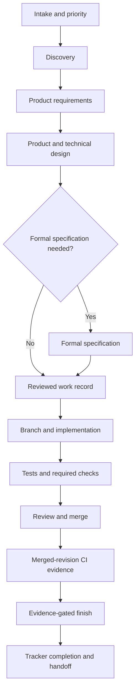

# AI-DLC development workflow

This is the canonical, compact map of the AI-DLC workflow. It describes stable
development stages and their evidence contracts. Tool names are kept in the
[tool map](workflows/tool-map.md) so providers can change without redefining the
lifecycle.

AI-DLC prepares tools, structure, and guidance for the chosen harness. Agents can
invoke installed provider tools directly. The services below own specific
validation and lifecycle boundaries; they do not mediate every development action.
See [product direction](product-direction.md) and the [roadmap](roadmap.md) for
planned capabilities.

Product requirements explain outcomes, specifications define behavior, tickets
organize deliverable slices, and tasks describe implementation steps. Link these
artifacts through stable references. UI/UX evaluation is an optional branch;
other work uses its own appropriate verification methods.

Use the [greenfield guide](workflows/greenfield.md) for a new application and
the [brownfield guide](workflows/brownfield.md) for an existing repository. The
[design-to-implementation guide](workflows/design-to-implementation.md) defines
the handoff between an approved design and code.

## Workflow at a glance



AI-DLC does not host an autonomous orchestrator. The human and agent decide
what work is useful. Skills provide judgment; the CLI validates, stores, links,
reconciles, and gates the resulting work. MCP exposes shared work, doctor, knowledge and documentation services.

## Stage contracts

| Stage | Purpose | Durable output | Exit condition |
| --- | --- | --- | --- |
| Intake | Reconcile an idea with current priorities | Tracker item or reviewed candidate | The next investigation is explicit |
| Discovery | Establish users, outcomes, constraints, evidence, and unknowns | Bounded problem statement | The problem is clear enough to define or stop |
| Product requirements | Record rationale, scope, outcomes, risks, and acceptance | Reviewed PRD when the change needs one | Material product questions are resolved or named |
| Design | Define journeys, states, system boundaries, interfaces, and consequential choices | Design document, diagram, and linked decisions | Implementers can act without inventing product behavior |
| Specification decision | Decide whether formal behavior needs a specification | Recorded decision and, when required, provider-owned specification | Required scenarios and acceptance criteria are current |
| Work publication | Bind reviewed scope to durable tracker state | `.ai-dlc/work/<id>.toml` and tracker item | The record is reviewed before external mutation |
| Implementation | Deliver the smallest coherent change on the bound branch | Code, tests, migrations, and updated durable docs | Local required checks pass |
| Review and merge | Evaluate correctness, maintainability, risk, and scope | Reviewed pull request and merged revision | Required review, repository rules, and fresh checks pass against the current target branch |
| Verification and finish | Authenticate the merge and its configured evidence | CI receipts and optional deployment evidence | `ai-dlc work finish <work-id>` accepts every configured gate |
| Continuity | Preserve only what the next person or session needs | Handoff, runbook updates, and linked personal notes | Remote state and remaining work are unambiguous |

Each stage consumes reviewed output from the previous stage. Skipping an
artifact is acceptable when the stage explicitly decides it is unnecessary;
silently replacing it with assumptions is not.

## Design to implementation ownership

For both greenfield and brownfield work, skills own discovery, requirements,
design judgment, and the specification decision. The CLI owns reviewed work
records, local checks, machine lifecycle commands, and completion gates. Local
MCP exposes reviewed work operations, read-only doctor inspection, and selected
knowledge operations; machine enrollment mutations are CLI-only in this cycle.
It does not create a second workflow. The design-to-implementation handoff is complete only when the
approved design, any required specification, and the reviewed work record let
implementation proceed without inventing behavior.

## Environment preparation

Start a session with `ai-dlc next` (or `context --brief`) for local next actions,
required checks and explicit tracker-not-consulted status. PR and archived-spec
references do not prove completion; finish remains evidence-gated. The session-start
hook includes the first ten summary lines. Plain `context` remains JSON.

Use the [machine enrollment runbook](runbooks/machine-enrollment.md) for private
profiles, readiness and client setup. Provider setup belongs in the relevant
runbook: [GitHub](github-ticket-setup.md), [Linear](runbooks/linear-setup.md),
[Plane](runbooks/plane-setup.md), or [Jira](runbooks/jira-cloud-setup.md).
The lifecycle below stays independent of the selected provider.

## Sources of truth

- The repository owns architecture, product rationale, design context,
  decisions, runbooks, code, and tests.
- The configured specification provider exclusively owns formal behavior
  specifications. Repository design documents link to specifications instead
  of copying them.
- The selected delivery tracker owns engineering priority and lifecycle status.
  When an upstream business tracker is used, it owns business priority, outcome
  scope and acceptance; see the Jira/GitHub ownership model below.
- SCM and CI own review, merge identity, and merged-revision evidence.
- Personal knowledge stores continuity, reflection, and private notes. It links
  durable repository material and is not a repository mirror.
- Portable configuration may name required environment variables, such as
  `token_env = "LINEAR_API_KEY"`, but never contains their secret values.
  Machine configuration owns account choices and local paths. `.ai-dlc/local/`
  may hold ignored non-secret control-plane IDs and local metadata. Actual
  credential values stay in an OS keychain, password manager, or secret
  injector and enter only the process environment.

When sources disagree, reconcile their owned facts rather than overwriting one
store with a copy from another.

## GitHub delivery with Jira outcomes

Sean's personal profile selects GitHub Issues for delivery, with a GitHub Project
configured per repository for planning. Jira is the upstream owner of business
outcomes when work needs it. One Jira story or epic can link to several GitHub
delivery issues. Small fixes and maintenance may start in GitHub without a Jira
parent; link them upstream when they affect a business commitment.

This is a manual workflow today. The profile comments express intent, not an
enabled Jira connection or synchronization service. Each work record still has
one selected tracker. Selecting `jira-cloud` instead makes Jira that delivery
tracker; it does not connect Jira outcomes to GitHub issues.

| Location | Owns |
| --- | --- |
| Jira | Business outcome, stakeholder priority, scope and acceptance |
| Repository documents | Discovery, product rationale and design decisions |
| OpenSpec | Required behavioral specifications |
| GitHub Issues | Deliverable engineering tasks, dependencies and acceptance evidence |
| GitHub Projects | Delivery planning, sequencing and progress |
| Pull requests and CI | Review, merge and verification evidence |

### From intake to business acceptance

1. **Intake:** A Jira ticket identifies an outcome. Triage decides whether it
   needs discovery, clarification or delivery planning. Creating the ticket does
   not authorize development. GitHub-originated engineering work enters the same
   shaping and specification decision stages at the depth it needs.
2. **Shaping:** Capture discovery, product requirements when needed, and design
   decisions in repository documents. Review the requirements and record the
   formal specification decision; keep required OpenSpec artifacts current.
3. **Breakdown:** Create reviewed work records for independently deliverable
   GitHub issues. Link their requirements, design and specification, and record
   the Jira outcome URL as `artifacts.jira_parent` when applicable. Sequence the
   issues and their dependencies in GitHub Projects.
4. **Delivery:** Publish and start the reviewed work through AI-DLC, implement
   through pull requests, run required checks, and use `ai-dlc work finish` after
   merge to verify the configured completion gates. A board status alone is not
   delivery evidence.
5. **Acceptance:** When all agreed delivery work is verified, summarize the
   evidence and remaining concerns on Jira as ready for acceptance. Business
   acceptance controls Jira closure. One merged PR or completed child issue does
   not complete the outcome; partial delivery remains visible as outstanding work.

"Ready for acceptance" describes a handoff, not a prescribed Jira status ID or
automatic transition. Use the actual team's reviewed workflow. Jira scope changes
return to shaping and a review of affected specifications and delivery issues.
Cancellation or reopening requires explicit reconciliation of remaining work;
neither system's status automatically propagates to the other.

### Manual links now

Add the parent to the existing artifact table in each applicable work record:

```toml
[artifacts]
# Illustrative URL: replace with the actual Jira outcome's full URL.
jira_parent = "https://example.atlassian.net/browse/TEAM-123"
```

Retain the record's other artifact entries. `jira_parent` is an artifact naming
convention, not a second tracker binding or a validated cross-system parent-child
relationship. New GitHub issue publication includes these artifact references.
Repeat publication preserves authored issue descriptions, so adding the reference
later does not update an already published issue: manually add the link there too.
Maintain reciprocal links and concise delivery summaries on the Jira outcome.
Keep business rationale, design and formal behavior in their owned locations and
link them instead of maintaining competing copies.

Where configured, Atlassian's GitHub integration can show branches, commits and
pull requests on Jira work items when their keys appear in development work.
This provides development visibility; the workflow above still needs its manual
issue links and outcome summaries. See
[Atlassian's GitHub integration guidance](https://support.atlassian.com/jira-cloud-administration/docs/use-the-github-for-jira-app/).

### Gaps before automated synchronization

The existing Jira Cloud adapter supports Jira as the selected tracker. The
following coordination capabilities remain future work:

- Explicit Jira intake that prepares reviewable local discovery and work context.
- Structured outcome-to-delivery mappings across work items and repositories.
- Aggregate reporting of verified, outstanding and blocked delivery work.
- Field ownership and conflict handling: Jira supplies business scope and priority;
  GitHub supplies engineering progress. Changed scope returns for review.
- Retry-safe synchronization that preserves authored content, reconciles uncertain
  writes, and never closes a Jira outcome merely because one PR merged.

Company Jira access and workflow compatibility remain unverified. Manual linking
does not require enabling the Jira adapter; future automation needs the actual
approved company connection and workflow mappings. See
[work-computer setup](workflows/work-computer-setup.md) for GitHub delivery setup
and the explicit Jira-only alternative.

## Capability boundaries

Initialization and adoption may select any subset of `specs`, `tracker`,
`knowledge`, `scm`, `deploy`, and `agent-client`. Selection controls declared
roles and generated provider assets. The runtime retains compatibility
fallbacks for local OpenSpec and GitHub, but a fallback does not choose an
account, repository, or authorization and must not be mistaken for a configured
role. GitHub uses conventional `verify.yml` and `main` defaults unless they are
overridden. The tracker has no fallback.

- Project setup, checks, architecture, design, decisions, and runbooks remain
  useful without external providers.
- The publish/start/finish lifecycle requires configured tracker and
  SCM roles. Without either role, use the local project lifecycle and manual
  tracking, or configure the missing role before publishing work.
- `work status` inspects the local record and specification archive state without
  querying the tracker. Read the configured tracker directly for current remote status.
- Without a declared specification role, work may deliberately use the local
  OpenSpec compatibility fallback when its formal artifacts exist. Otherwise,
  work that does not require a specification records `requires_spec = false`
  with a reviewed reason; work that does require one configures the role.
- Knowledge, deployment evidence, and agent clients are optional. Their stages
  are omitted when their roles are not selected; deployment becomes a finish
  gate only when configured.
- Omitting SCM also omits the generated GitHub workflow. Local required checks
  still run, but merged-revision CI completion is unavailable.

## Daily operating loop

1. Reconcile tracker priority, work bindings, branch state, and fresh evidence.
2. Use discovery when the problem or outcome is unclear.
3. Draft and review product requirements when durable rationale is needed.
4. Produce the minimum design that closes product and technical ambiguity.
5. Record whether formal specification is required and make it current when it
   is.
6. Review the work record, then publish and start it through AI-DLC.
7. Implement on the bound branch with acceptance and regression tests.
8. Run `ai-dlc project check --required` before review.
9. Immediately before merge, update the branch from the target branch and rerun
   required checks; record documentation dispositions again only for targets the
   gate reports stale. Merge through the configured SCM and
   finish through AI-DLC so current specification, merged revision, CI receipts,
   and deployment evidence are checked together.
10. Update durable documentation and leave a concise handoff when continuity is
    needed.

## Completion is evidence-gated

`ai-dlc work finish <work-id>` is the completion boundary for projects with the
required tracker and SCM capabilities. It checks the authenticated merged
revision rather than the local checkout. The generated single-job GitHub
workflow publishes `ai-dlc-receipt`; matrix repositories declare every exact
expected artifact in `scm.receipt_artifacts`. A missing, malformed, dirty,
mismatched, duplicate, or expired receipt blocks completion.

Tracker completion never substitutes for a merge, green CI, a current required
specification, or configured deployment evidence. Failures remain visible and
retryable instead of being converted into success.

### Changing the trusted service invalidates work bindings

A work record pins a fingerprint per provider role, so reviewed work cannot be
retargeted at a different service without an explicit review. The SCM fingerprint
covers the `[scm]` settings that decide which service is trusted: `repository`,
`target_branch` and `workflow`. The tracker and deployment fingerprints embed the
same projection. Changing any of them drifts three of the five bindings on every
existing record, and `ai-dlc work finish` refuses with `Provider binding drift`
until each affected record is reviewed again.

Receipt artifact policy is deliberately excluded. The finish gate reads the expected
receipt names from `ai-dlc.toml` at the merged revision, never from a binding, so
hashing `receipt_artifacts` would invalidate every record on each CI matrix change
without protecting anything. Changing the receipt matrix therefore does not drift
bindings, and the gate still requires every receipt the merged manifest names. Any
other `[scm]` key does contribute to identity, so a new setting cannot bypass the
guard by being unrecognised.

When a binding does drift, review the affected records and remove the drifted
binding lines so they are recomputed against the current configuration. Do not use
`ai-dlc project rebind`, which migrates a role to a different provider and requires
explicit replacement artifacts for every retained record. Records already finished
keep their historical fingerprints; leaving them untouched preserves what they were
actually reviewed against, so resuming old work still meets the refusal and the same
review.

### Finishing after the target branch moved

The specification gate reads the archived change from the working checkout, so
that checkout must be exactly the pull request's merge commit with a clean
`openspec/` tree. Finishing immediately after merge satisfies this from the
updated main checkout. Once the target branch advances, or when several merged
items are finished later, prepare a temporary detached checkout instead:

```sh
git worktree add --detach /tmp/finish-<work-id> <merge-commit>
cd /tmp/finish-<work-id> && ai-dlc work finish <work-id>
cd - && git worktree remove /tmp/finish-<work-id>
```

Take the merge commit from the pull request the work record binds; the blocked
reason also names it together with the revision the current checkout holds. Each
item finished this way needs its own merge commit. The gate is unchanged: a
checkout that is not exactly the merged revision, or one with modified or
untracked `openspec/` files, still refuses. Do not relax the gate or re-archive a
change to make a later checkout match.

## When a work record is needed

A work record binds reviewed scope to a tracker item, a branch and a pull request
so that `ai-dlc work finish` can close that item against the merged revision and
its CI receipts. Create one when the change delivers a tracker item or needs a
formal specification.

No required check demands a record for every change. `work validate --all` checks
the records that exist, and the documentation gate reads evidence, not records. A
change with no tracker item and no specification decision — a documentation
correction, a roadmap edit, a dependency bump — needs only its pull request, with
scope and verification in the body, and documentation evidence recorded under any
identifier (`--evidence-id <branch-or-topic>`). A record created for such a change
has nothing to finish and stays open in the context brief indefinitely.

## Merge against the current target branch

Documentation-impact decisions are stored per work item under
`.ai-dlc/documentation/evidence/<id>.json`. Each decision binds the content of its
own target and of the sources mapped to it, including that document's catalog
entry. It does not name a target-branch commit. Pull request CI supplies the pull
request's base commit, the target-branch run after merge supplies the commit that
the merge replaced, and the gate computes changed files from the merge base of
that comparison and `HEAD`. The comparison never comes from the evidence.

A moved target branch therefore invalidates a decision only when it changed
content that the decision bound. Branches with disjoint changes merge in either
order with no evidence rewrite and no shared file to conflict on. Immediately
before merging:

1. Fetch and update the branch from the target branch.
2. Run `ai-dlc project check --required`. When `docs gate` reports a *stale*
   target it names the paths whose content differs; review those and record that
   target again with `docs review --disposition ... --evidence-id <id>`, which
   keeps the decisions that remain valid. *Missing* targets need a first decision.
3. Push the update and wait for fresh required checks.

Pull request checks do not rerun when the target branch moves, so a green check
can predate a target change that touched bound content; the target-branch run
after merge then fails and names it. Enable the branch protection or ruleset
option that requires branches to be up to date before merging, with the Verify
jobs as required checks, to catch that before merge. It is a repository setting
that an administrator changes deliberately; AI-DLC does not change it.

Evidence files whose decisions no longer match any current target are inert.
`ai-dlc docs review --base <target> --prune` lists them and `--apply` removes
them; pruning never gates. A project that still holds only schema 1
`.ai-dlc/documentation/current.json` keeps its recorded-base rules for one
release: that file names an exact commit and must be recorded again whenever the
target branch moves. The first per-work recording supersedes it; delete it then.

## Maintaining this handbook

- Keep lifecycle stages and role names provider-neutral.
- Update [the tool map](workflows/tool-map.md) when a configured provider,
  command, or skill changes.
- Update the greenfield or brownfield guide when initialization or adoption
  behavior changes.
- Update the design handoff when required design evidence changes.
- Store diagrams as Mermaid beside the text they explain. Exported images are
  optional views, never the editable source.
- Change the handbook, project template, relevant skills, and behavior in the
  same pull request when they form one contract.
- Use Git history for evolution; do not maintain a parallel changelog inside
  every guide.
