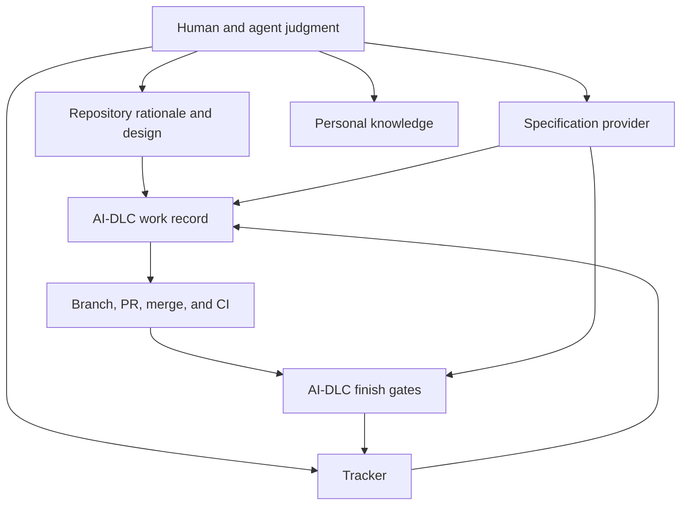

# Workflow tool map

The lifecycle uses stable roles; `ai-dlc.toml` selects their current providers.
This page records how the default AI-DLC toolset participates without making a
vendor part of the lifecycle definition.

Installed tool use, harness guidance, and provider adapters are complementary.
Agents can use native tools directly; the configured services provide specific
validation and completion boundaries. The [roadmap](../roadmap.md) distinguishes
planned component/workflow support from the current interfaces listed here.

[Back to the workflow map](../development-workflow.md)

## Role to provider mapping

| Stable responsibility | AI-DLC role or service | Current default | Owns |
| --- | --- | --- | --- |
| Formal behavior | `specs` | OpenSpec | Requirements and scenarios |
| Priority and lifecycle | `tracker` | GitHub Issues and Projects | Work identity, priority, and status |
| Personal continuity | `knowledge` | Obsidian | Private notes, reflection, and links |
| Review, merge, and CI identity | `scm` | GitHub | Branches, pull requests, merged SHA, workflow runs, and artifacts |
| Deployment evidence | `deploy` | None by default | Environment-specific release evidence when configured |
| Interactive agent | `agent-client` | Claude Code and Codex | Analysis, judgment, authoring, and tool use under user authorization |
| Deterministic workflow | AI-DLC CLI and selected MCP services | Local Python implementation | CLI: validation, rendering, machine bindings, reconciliation, receipts, and gates; MCP: reviewed work, doctor, and knowledge only |
| Project generation and updates | Template service | Copier | Template answers, source revision, preview, and three-way updates |

Projects may omit roles they do not need. Confirm the actual mapping in the
project's `ai-dlc.toml`; do not infer an account, workspace, repository, or
environment from these defaults.

GitHub Issues and Projects is the recommended work tracker with recorded live
evidence. Jira Cloud remains available pending its live workflow qualification;
Plane is an available, unqualified adapter outside the default toolset. Follow the
[Jira preparation record](https://github.com/Sean-Koval/ai-dlc/blob/main/docs/verification/jira-cloud-new-work.md)
for prerequisites and execution limits; adapter availability alone does not
establish readiness.

The complete evidence-gated work cycle currently requires configured tracker
and SCM roles. The runtime retains compatibility fallbacks for local OpenSpec
and GitHub, but they do not choose account, repository, or authorization.
GitHub uses conventional `verify.yml` and `main` defaults unless overridden;
the tracker has no fallback. Without a configured tracker or SCM role, project
initialization, adoption, setup, checks, design, and documentation remain
available, but publish/start/finish is not a usable end-to-end lifecycle.
A missing specification role may deliberately use local OpenSpec when its
artifacts exist; otherwise the work must be reviewed with
`requires_spec = false`. Knowledge, deployment, and agent clients remain
optional.

## Skill map

| Moment | Skill | Expected judgment output |
| --- | --- | --- |
| Start of work | `day-start` | Reconciled priority, bindings, branch, and evidence |
| Unclear problem | `discovery` | Bounded problem, evidence, assumptions, questions, and next investigation |
| Durable product rationale | `prd-draft` | Reviewed problem, outcomes, scope, constraints, risks, and acceptance |
| Specification decision | `needs-spec` | Explicit decision based on behavior and risk |
| Approved behavior | `spec-from-prd` | Provider-owned requirements and scenarios linked to rationale |
| Incoming idea or note | `review-inbox` | Classification and next action without automatic publication |
| Session or ownership transfer | `handoff` | Verified state, decisions, evidence, risks, and next action |
| End of work period | `day-end` | Concise continuity record and reconciled remote state |

Skills provide judgment patterns. Provider instructions define vendor
operations. AI-DLC services own validation and mutation boundaries. A skill
cannot bypass completion gates or expand the user's authorization.

## Portable enrollment boundary

A private profile repository owns the portable `ai-dlc-profile.toml` and is
enrolled by pinned revision. A second machine enrolls that same revision but
maintains its own machine binding for paths, account selection, and
environment-variable names. The project repository owns shared policy; an
external password manager, keychain, or secret injector owns credential values
and supplies them transiently through the process environment. Codex and Claude
own their generated client configuration. Never commit `.env` files or
credential values.

`ai-dlc machine status`, `plan`, `apply`, `sync`, and `doctor` own the local
enrollment lifecycle. Local CLI and MCP execution are current; hosted or cloud
execution is a later qualification target. Existing Obsidian vaults support portal linking and explicit local project mounts; vault creation is not provided. Guided discovery/setup is
implemented for Linear, GitHub, Jira Cloud and Plane. Jira and Plane live workflow
qualification and native Antigravity integration remain pending.

Machine enrollment mutations are CLI-only in this cycle. MCP exposes exactly
`work_context`, `work_publish`, `work_start`, `work_status`, `work_link`, `work_finish`,
`doctor`, `knowledge_find`, `knowledge_append`, and `knowledge_note`; it does
not expose machine enrollment mutation. These MCP identifiers differ from the
space-separated CLI commands, such as `ai-dlc work publish` and `ai-dlc
knowledge append`.

## Command and service map

| Area | Interfaces | Effect |
| --- | --- | --- |
| Readiness and context | `ai-dlc doctor`, `ai-dlc next`, `ai-dlc context` | Checks the selected environment; `next` and `context --brief` show local next actions without consulting the tracker |
| Project creation | `ai-dlc project init`, `ai-dlc project adopt` | Initializes a project or previews/applies conflict-safe adoption |
| Project maintenance | `ai-dlc project sync`, `ai-dlc project rebind` | Performs staged Copier updates or previews/applies reviewed provider rebinding, including reviewed provider connection rebinding |
| Project execution | `ai-dlc project setup`, `ai-dlc project check --required` | Runs declared setup and checks and emits verification receipts |
| Agent configuration | `ai-dlc agents render` | Previews, applies, or verifies owned project/personal client configuration |
| Local work drafting | `ai-dlc work new WORK_ID [--from-issue REF]` | Creates an unreviewed record from explicit fields or a configured tracker read; does not publish or initialize mutation state |
| Work lifecycle | `ai-dlc work publish`, `ai-dlc work start`, `ai-dlc work pr`, `ai-dlc work finish` | Reconciles tracker state, binds work to a branch, and enforces completion gates |
| Local work inspection | `ai-dlc work status` | Reads the local record and active/archived specification state without querying tracker status |
| Specification finalization | `ai-dlc work archive` | Archives this work's OpenSpec change, promotes specifications, repoints the record and commits only affected files before merge |
| Traceability | `ai-dlc work link` | Links PR, specification, branch, deployment, or tracker evidence and commits only the work record by default |
| Provider inspection and connection | `ai-dlc provider list`, `ai-dlc provider test`, `ai-dlc provider connect` | Discovers adapters, runs isolated contract or authorized live checks, and previews/applies an explicitly reviewed provider connection |
| Tracker migration | `ai-dlc project tracker-migrate` | Reviews a default-only switch or selected existing-ticket mappings with local recovery evidence |
| Personal knowledge | `ai-dlc knowledge find`, `ai-dlc knowledge note`, `ai-dlc knowledge append` | Reads or writes explicitly selected vault material |
| Configuration profiles | `ai-dlc profile show`, `ai-dlc profile migrate`, `ai-dlc profile capture` | Resolves provenance, previews schema migration, or captures supported preferences |
| Machine provisioning | `ai-dlc setup plan`, `ai-dlc setup apply` | Previews or applies selected workstation modules and personal agent configuration |
| Agent-native access | `ai-dlc mcp serve` | Exposes reviewed work, read-only doctor, and selected knowledge services through local MCP; machine enrollment mutation remains CLI-only |
| Engine evaluation (maintainers) | `ai-dlc eval plan SUITE --profile PROFILE`, `ai-dlc eval run SUITE --profile PROFILE --out DIR`, `ai-dlc eval report DIR`, `ai-dlc eval image --base IMAGE` | `plan` validates a suite and execution profile offline and prints the scenario, arm and attempt matrix. `run` executes each attempt in an isolated, network-less container, grades hidden acceptance tests in a separate container and retains inputs and evidence; it needs Docker and locally present pinned images, and never pulls. `image` builds the treatment arm's candidate image from this checkout's wheel and locked, hash-pinned constraints on top of the baseline image; it needs uv, Docker and a package index. `report` rebuilds `report.json`, JUnit and a failure timeline from a run directory alone, and marks changed, missing or truncated evidence as incomplete |
| Legacy compatibility | `ai-dlc scaffold` | Preserves the retired Rust-era provider scaffolding interface |

## Artifact ownership

- Repository: architecture, PRDs, design context, ADRs, runbooks, code, tests.
- Specification provider: formal behavior and scenarios.
- Tracker: priority, work identity, lifecycle state.
- SCM/CI: review, merge identity, test artifacts, and receipts.
- Knowledge provider: private continuity and links to durable artifacts.
- Portable project configuration: provider roles and names of required
  environment variables, never their values.
- Local machine scope: account choices, paths, caches, journals, and ignored
  non-secret control-plane IDs and metadata.
- External password manager, keychain, or secret injector: actual credential
  values, supplied transiently through the process environment.

## CI and release evidence

The generated GitHub workflow runs reviewed bootstrap artifacts and required
checks, then uploads a receipt. Single-job projects use `ai-dlc-receipt`.
Matrix repositories list every exact expected artifact in
`scm.receipt_artifacts`; finish reads this declaration from the authenticated
merged revision and validates every receipt.

Until a signed and pinned AI-DLC release exists, projects must supply the
published `bootstrap/release.sh` and corresponding artifact manifest instead
of inventing an unpinned download URL. Release gates must cover clean-machine
bootstrap and artifact integrity.

Skill publication has a separate behavioral gate: run no-guidance control and
skill-enabled scenarios from `agents/evaluation.toml`, preserve transcripts,
and record human scoring. Packaging a skill is not evidence that it changes
agent behavior correctly.

## Evolving the toolset

When replacing or adding a tool:

1. Keep the lifecycle stage and responsibility stable where possible.
2. Update `ai-dlc.toml`, provider contracts, and machine credential references.
3. Describe the new provider here and remove claims that no longer apply.
4. Update relevant skills only when the judgment pattern changes.
5. Rebind existing work through reviewed mappings; provider changes apply to
   new work by default.
6. Add deterministic contract and integration tests plus an explicit live
   walkthrough for externally mutating providers.
7. Update diagrams and project templates in the same reviewed change.

Never place secret values, account identifiers, or machine-local paths in this
map. Naming a required environment variable in portable configuration is safe;
storing its value there is not.

## Optional Design PM route

For interface work, design-brief links the shaped outcome and RQ IDs to a draft
brief, reviewed task rubric and explicit budget. The user's existing visual tool
performs generation. Design-evaluate records candidate-specific observations,
required failures, ratings and unverified checks, with separate-session or human
review where available and explicit self-review otherwise. No extra installed
service, fixed model or mandatory paid tool is required.

Follow [design to implementation](design-to-implementation.md#optional-interface-evaluation)
for the four portable templates and original examples. Formal behavior remains
with the selected specification provider; the tracker owns delivery status, and
existing finish gates remain authoritative. The separate human calibration
protocol is unrun and does not spend the existing generic skill-evaluation budget.

## Documentation and private workspace tools

| MCP tool | CLI counterpart | Purpose |
|---|---|---|
| `project_docs_impact` | `docs review` | Find mapped documents and unmapped changes for an explicit Git comparison |
| `project_docs_disposition` | `docs review --disposition` | Emit content-bound reviewed decisions without writing evidence |
| `project_docs_record` | `docs review --disposition --evidence-id` | Merge reviewed decisions into one work item's evidence file, keeping decisions whose bound content is unchanged |
| `project_docs_gate` | `docs gate` | Check current dispositions and new objective debt |
| `project_docs_inventory` | `docs check --inventory` | Discover repository Markdown paths, exclusions and unavailable paths without reading bodies |
| `project_docs_search` | `docs search` | Search `docs/`, `openspec/` and per-call declared Markdown under one body budget; returns canonical paths, digests and explicit omissions |
| `project_docs_read` | `docs read` | Read one complete eligible project document within a byte budget; undeclared root or legacy files are refused |
| `project_docs_review` | `docs review --report` | Prepare bounded selected-document context; explicit `source=inventory` permits uncatalogued documents |
| `project_docs_review_check` | `docs review --check` | Check citations, scope and source bytes; does not certify semantic truth |
| `project_workspace_preview` | `project workspace-init` | Preview additive private project navigation; CLI apply explicitly creates files |
| CLI only | `project workspace-init --shell` | Preview the owned bash, zsh or fish PATH section; `--apply` writes after ownership checks |
| `project_workspace_check` | `project workspace-check` | Report installation, shell activation, each mount binding and link navigation separately; read-only, native client not assessed |

Project-document search and read cover repository files, never private notes.
Declare additional Markdown per call with repeated `--source` (MCP `sources`);
nothing is persisted. Edit returned repository paths with ordinary file and Git
tools and run project checks. The `knowledge_*` tools remain for private notes,
and a vault portal, mounted folder or Markdown link does not grant access.

The [documentation guide](../../project-templates/project/docs/documentation-guide.md#search-and-read-project-documents) explains ownership, packet
review, project-document access, baselines and workspace use. The optional CLI `docs check --style` invokes
configured Vale; it does not install a tool or establish factual correctness.

### Native project mounts

`ai-dlc project link-vault --mode mount --preview` previews canonical `docs/` and
existing `openspec/` directory mounts; omit `--preview` to apply. The MCP
`project_vault_mount_preview` tool uses the same read-only plan. Portal mode
remains the default. Mounting does not expand private knowledge read/write access.
See the documentation guide for stable-checkout, adoption and conflict handling.
`ai-dlc project workspace-check` (MCP `project_workspace_check`) diagnoses the
executable, shell activation, bindings and navigation without changing them.

### Session continuity

`ai-dlc work finish <id> --learning FILE` optionally stores an authored learning
through the knowledge provider after completion gates pass. MCP `work_finish`
accepts `learning` text alongside its existing `handoff`. Missing knowledge leaves
the note pending and preserves completion. `work start` returns up to five
matching learning paths and first lines; read relevant notes before implementing.
The session-start hook recalls notes for the branch's bound work record. Stop
reminders use only ignored local friction counts and never transmit them.

### Local frontend evidence

The optional node `frontend` capability supplies a Playwright smoke check.
`ai-dlc design capture` writes viewport screenshots and a manifest for
`design-evaluate`; browser installation belongs to explicit setup. A named state
waits for its visible selector and does not certify untested interactions.
See [frontend smoke and capture](design-to-implementation.md#frontend-smoke-and-capture-evidence).

## Local FDE engagement documents

`ai-dlc fde scaffold SLUG --title TITLE` creates an engagement charter, seven
stage landing pages and portable guidance beneath repository docs. `--dry-run`
returns exact proposed content without writing. `ai-dlc fde check SLUG` validates
structure, lifecycle states and preceding exit evidence. These CLI operations
share the documentation application service and have no provider connection or
MCP facade. See the [FDE runbook](../runbooks/fde-documents.md) for configuration
and the explicitly outstanding Confluence publication capability.
